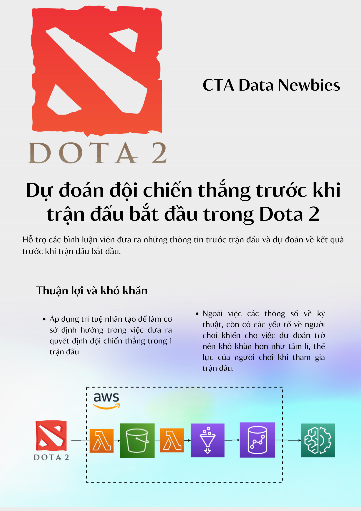
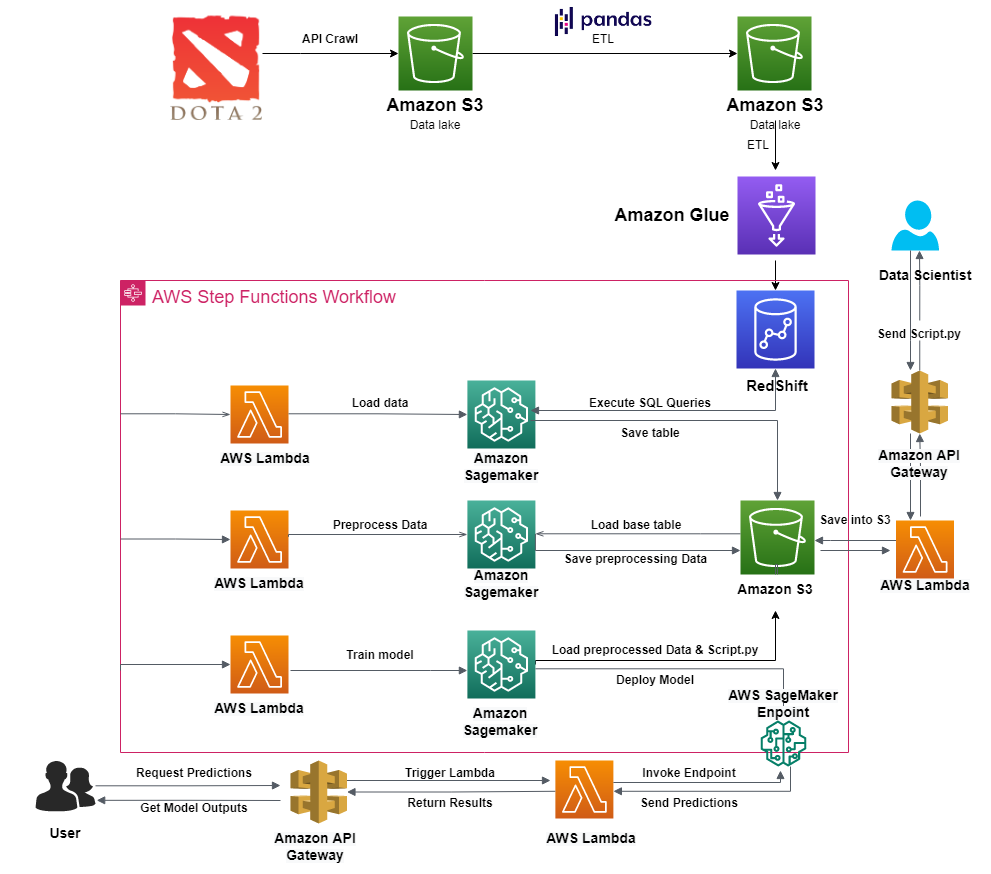
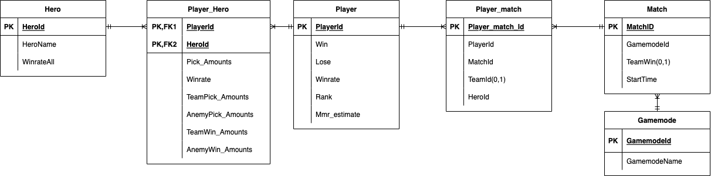

# FHM-HACKATHON-2022 - Connecting the world
## Predict the winning team before the match starts in Dota 2
## Table of Contents

- [Pipeline](#pipeline)
- [Table in Redshift](#table-in-redshift)
- [Steps to crawl data](#steps-to-crawl-data)
- [Steps to ETL data](#steps-to-etl-data)
- [API support](#api-support)
- [Support Command-line](#support-command-line)
- [Delete all commit in a branch](#delete-all-commit-in-a-branch)
<p align="center">
  
</p>

### Pipeline

### Table in Redshift


 
### Steps to crawl data

Run file following:
- `crawl_heroes.py` save to crawled_data/heroes.json.
- `crawl_pro_players.py` save to crawled_data/pro_player.json.
- `get_pro_player_id.py` save to check_download_pro_players.parquet .
- `crawl_player_matches.py` save to match file in crawled_data/players_matches/{player_id}.json.
- `get_match_id.py` save to check_download_match_id.parquet.
- `crawl_matches.py` save to match file in crawled_data/matches/{match_id}.json 
- `s3_etl_matches.py` save to new_lake/50k_matches.parquet and create check_download_player_id.parquet
- `crawl_all_players.py` save to crawled_data/players_info/{player_id}.json and crawled_data/players_wl/{player_id}.json and  crawled_data/players_heroes/{player_id}.json


### Steps to ETL data

Run file following:
- `s3_etl_heroes.py` save to new_lake/heroes.parquet.
- `s3_etl_players.py` save to new_lake/players.parquet
- `s3_etl_players_heroes.py` save to new_lake/players_heroes.parquet.
- `s3_etl_players_matches.py` save to new_lake/players_matches.parquet


### API support 
https://docs.opendota.com/

|               | Free Tier                           | Premium Tier                          |
|---------------|-------------------------------------|---------------------------------------|
| Price         | Free                                | $0.01 per 100 calls                   |
| Key Required? | No                                  | Yes -- requires payment method        |
| Call Limit    | 50000 per month                     | Unlimited                             |
| Rate Limit    | 60 calls per minute                 | 1200 calls per minute                 |
| Support       | Community support via Discord group | Priority support from core developers |


## Support Command-line

- To set your global username/email configuration:
Open the command line.

```
git config --global user.name "FIRST_NAME LAST_NAME"
git config --global user.email "MY_NAME@example.com"
```

- Create Virtual Environment :

```console
python -m venv venv
venv\Scripts\activate
(venv) >
``` 
```console
python3 -m venv venv
venv\bin\activate
(venv) >
``` 
> Deactivate Virtual Environment :

```console
deactivate
``` 
> fix `cannot be loaded because running scripts is disabled on this system`:
```console
set-ExecutionPolicy RemoteSigned -Scope CurrentUser 
Get-ExecutionPolicy
Get-ExecutionPolicy -list  
```
 
- Create requirements.txt :

```console
py -m pipreqs.pipreqs . --encoding=utf8
``` 

- Create requirements.txt with all library already exists:

```console
pip freeze > requirements.txt
```

- Install requirements:
```console
pip install -r requirements.txt
```
- Use pytest:
```console
pytest tests
pytest tests/test_export_data.py::TestRealTime
pytest tests/test_export_data.py::TestRealTime::test_real_time_negative
```
- Upgrade library:

```console
pip install -U <library>
```
- Upgrade pip:

```console
py -m pip install --upgrade pip
```

### Delete all commit in a branch
Deleting the .git folder may cause problems in your git repository. If you want to delete all your commit history but keep the code in its current state, it is very safe to do it as in the following:
``
Checkout

`git checkout --orphan latest_branch`

Add all the files

`git add -A`

Commit the changes

`git commit -am "commit message"`

Delete the branch

`git branch -D main`

Rename the current branch to main

`git branch -m main`

Finally, force update your repository

`git push -f origin main`
``
PS: this will not keep your old commit history around

###### [on top](#table-of-contents)